# Microservices Communication

1. Setting up Eureka Server
   1. Add the following dependencies
   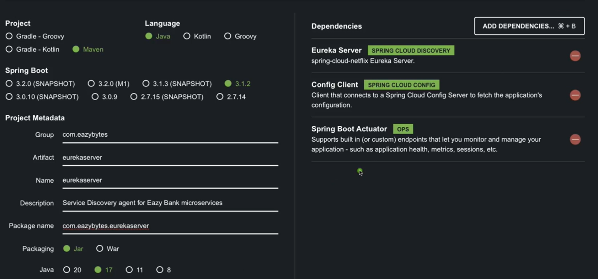
   2. Add the @EnableEurekaServer annotation to main class
   3. Add the config properties
   ```yaml
    spring:
    application:
    name: "eurekaserver"
    config:
    import: "optional:configserver:http://localhost:8071/"
    
    management:
    endpoints:
    web:
    exposure:
    include: "*"
    health:
    readiness-state:
    enabled: true
    liveness-state:
    enabled: true
    endpoint:
    health:
    probes:
    enabled: true
   ```
    4. Add the configuration details with **ConfigServer**
   ```yaml
    server:
    port: 8070
    
    eureka:
    instance:
    hostname: localhost
    client:
    fetchRegistry: false
    registerWithEureka: false
    serviceUrl:
    defaultZone: http://${eureka.instance.hostname}:${server.port}/eureka/
   ```
   5. Start the ConfigServer, since eureka server have config related dependency 
   6. Start the Eureka server
2. Setup the microservice to register themselves to eureka server
   1. Add Eureka Client Dependency
      ```xml
      <dependency>
         <groupId>org.springframework.cloud</groupId>
         <artifactId>spring-cloud-starter-netflix-eureka-client</artifactId>
       </dependency>
      ```
   2. Set up the properties file to connect to eureka server
   ```yaml
   management:
   endpoints:
   web:
   exposure:
   include: "*"
   endpoint:
   shutdown:
   enabled: true
   info:
   env:
   enabled: true
   
   endpoints:
   shutdown:
   enabled: true
   
   eureka:
   instance:
   preferIpAddress: true
   client:
   fetchRegistry: true
   registerWithEureka: true
   serviceUrl:
   defaultZone: http://localhost:8070/eureka/
   
   info:
   app:
   name: "accounts"
   description: "Eazy Bank Accounts Application"
   version: "1.0.0"
   ```
   3. Start the microservices, observe that every mciroservice register themselves with eureka server and send heart beats every 30 sec
   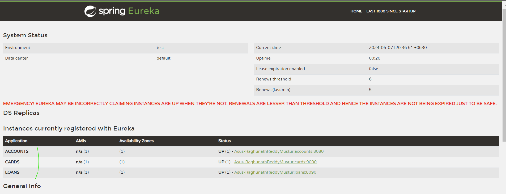
   4. For detial info about microservices
      `http://localhost:8070/eureka/apps/accounts`
   5. Shutting down the microservice using actuator endpoint
      6. Microservice will deregister itself from eureka server
         `post : http://localhost:8080/actuator/shutdown`
   6. Micro services will through exception if the eureka server is down while sending the heart beats

Communicating with other microservices with help of feign client
----------------------------------------------------------
1. Add the Open Feign dependency in required microservice
   ```xml
    <dependency>
      <groupId>org.springframework.cloud</groupId>
      <artifactId>spring-cloud-starter-openfeign</artifactId>
    </dependency>
   ```
2. Add `@EnableFeignClients `to main class
3. Add the Feign client code in service
   ```java
   @FeignClient("cards")//cards : name should same used to register with eureka server
   public interface CardsFeignClient {
   
       //method signature and api mapping(like get) should match with microservice api
       @GetMapping(value = "/api/fetch", consumes = "application/json")
       public ResponseEntity<CardsDto> fetchCardDetails(@RequestParam String mobileNumber);

   ```
4. Inject the feign clients as dependencies and invoke them
   ```java
    private CardsFeignClient cardsFeignClient;
    private LoansFeignClient loansFeignClient;
        
   ResponseEntity<LoansDto> loansDtoResponseEntity = loansFeignClient.fetchLoanDetails(mobileNumber);
   customerDetailsDto.setLoansDto(loansDtoResponseEntity.getBody());
   ```
   
Dockerizing the Microservices
-----------------------
1. Generate the Docker Images using google mvn compile jib:dockerBuild
   2. Create the docker compose 
      1. common-config.yml
         ```yaml
         services:
         network-deploy-service:
         networks:
         - eazybank
      
         microservice-base-config:
         extends:
         service: network-deploy-service
         deploy:
         resources:
         limits:
         memory: 700m
      
         microservice-configserver-config:
         extends:
         service: microservice-base-config
         environment:
         SPRING_PROFILES_ACTIVE: default
         SPRING_CONFIG_IMPORT: configserver:http://configserver:8071/
      
         microservice-eureka-config:
         extends:
         service: microservice-configserver-config
         environment:
         EUREKA_CLIENT_SERVICEURL_DEFAULTZONE: http://eurekaserver:8070/eureka/
         ```
      2. Specific 
         ```yaml
         services:
         rabbit:
         image: rabbitmq:3.13-management
         hostname: rabbitmq
         ports:
         - "5672:5672"
           - "15672:15672"
           healthcheck:
           test: rabbitmq-diagnostics check_port_connectivity
           interval: 10s
           timeout: 5s
           retries: 10
           start_period: 5s
           extends:
           file: common-config.yml
           service: network-deploy-service
         
         configserver:
         image: "eazybytes/configserver:s6"
         container_name: configserver-ms
         ports:
         - "8071:8071"
         depends_on:
         rabbit:
         condition: service_healthy
         healthcheck:
         test: "curl --fail --silent localhost:8071/actuator/health/readiness | grep UP || exit 1"
         interval: 10s
         timeout: 5s
         retries: 10
         start_period: 10s
         extends:
         file: common-config.yml
         service: microservice-base-config
         
         accounts:
         image: "eazybytes/accounts:s6"
         container_name: accounts-ms
         ports:
         - "8080:8080"
         depends_on:
         configserver:
         condition: service_healthy
         environment:
         SPRING_APPLICATION_NAME: "accounts"
         extends:
         file: common-config.yml
         service: microservice-configserver-config
         
         loans:
         image: "eazybytes/loans:s6"
         container_name: loans-ms
         ports:
         - "8090:8090"
         depends_on:
         configserver:
         condition: service_healthy
         environment:
         SPRING_APPLICATION_NAME: "loans"
         extends:
         file: common-config.yml
         service: microservice-configserver-config
         
         cards:
         image: "eazybytes/cards:s6"
         container_name: cards-ms
         ports:
         - "9000:9000"
         depends_on:
         configserver:
         condition: service_healthy
         environment:
         SPRING_APPLICATION_NAME: "cards"
         extends:
         file: common-config.yml
         service: microservice-configserver-config
         
         networks:
         eazybank:
         driver: "bridge"
         ```
         
About Microservice Communication
--------------------------------
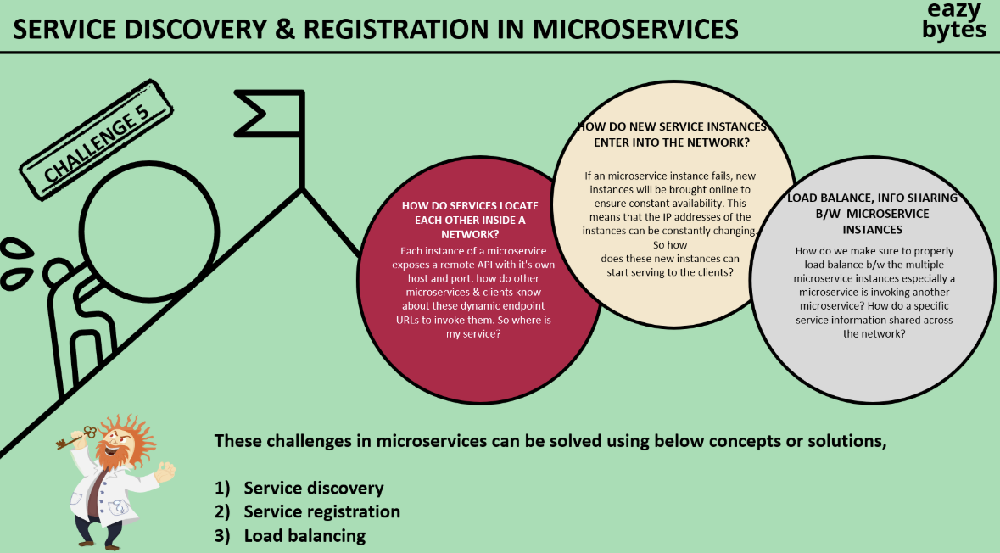
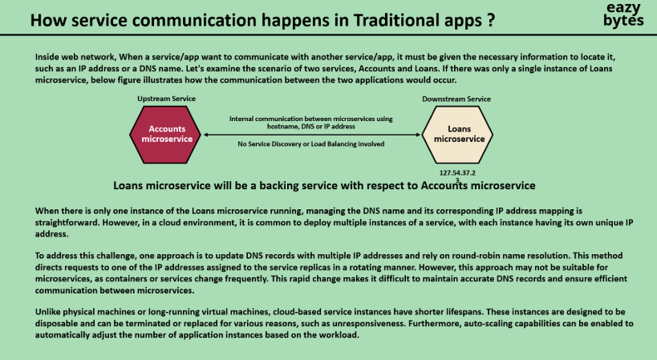
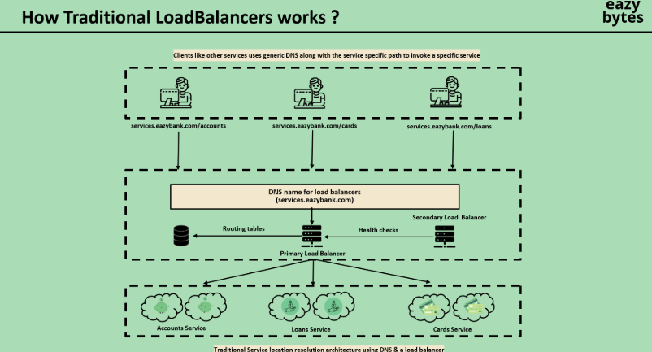
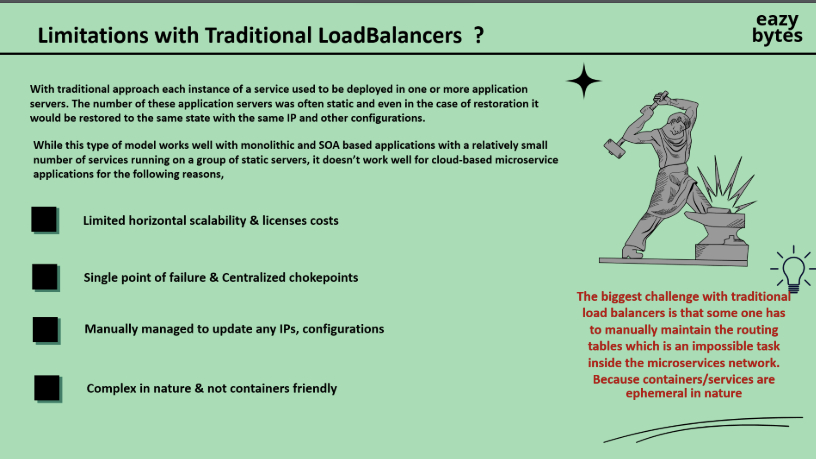
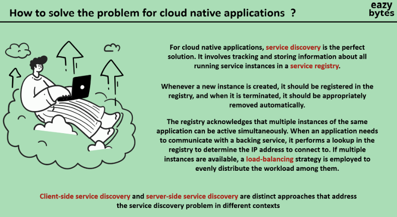
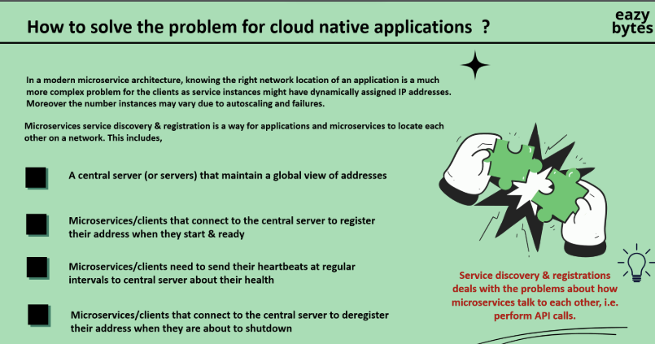
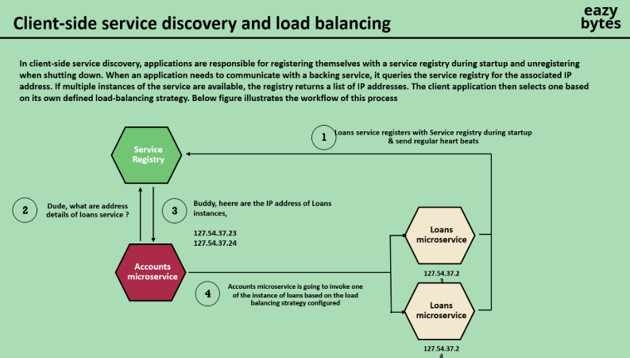
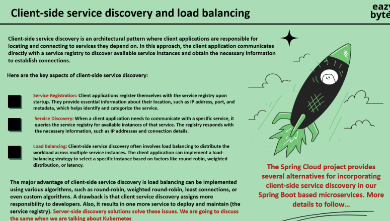
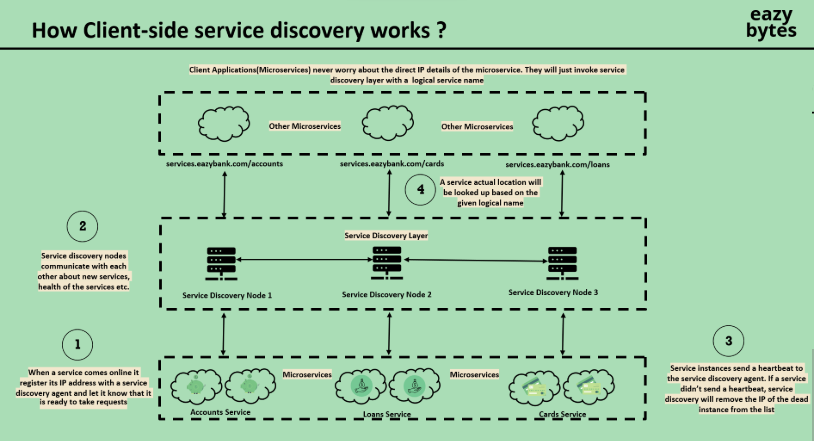
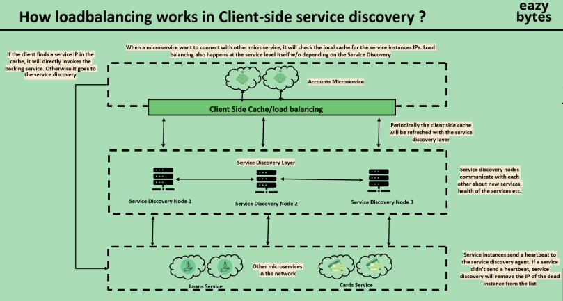
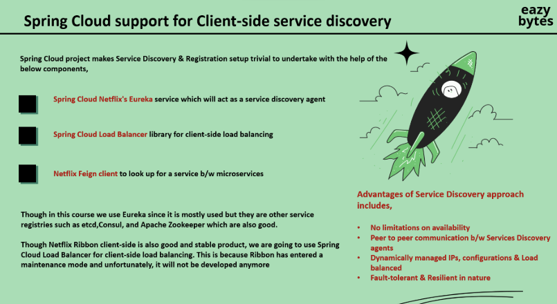
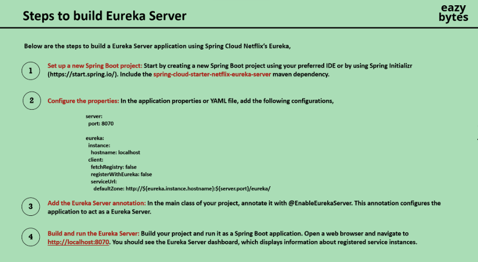
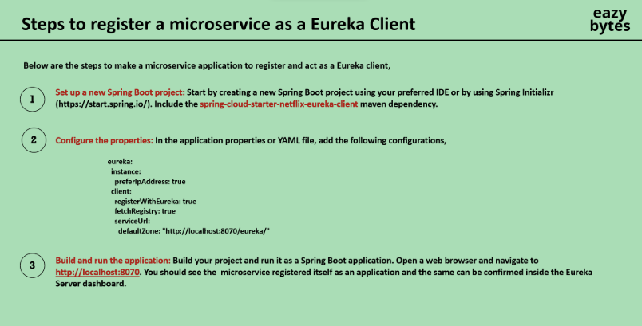
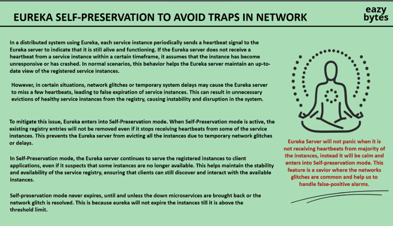
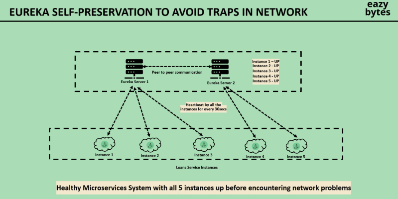
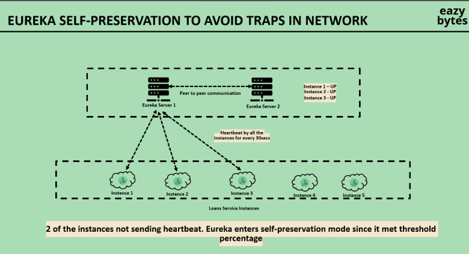
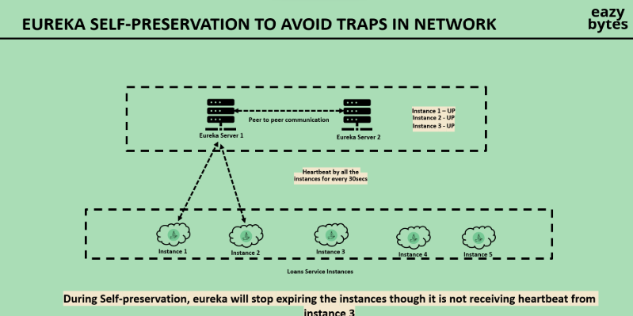
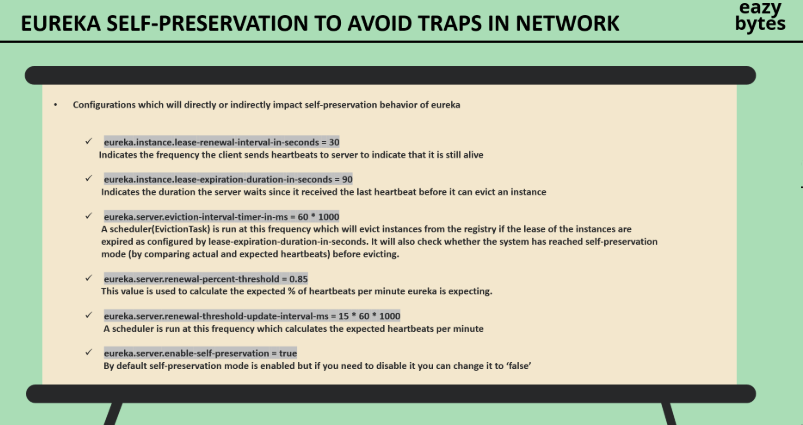